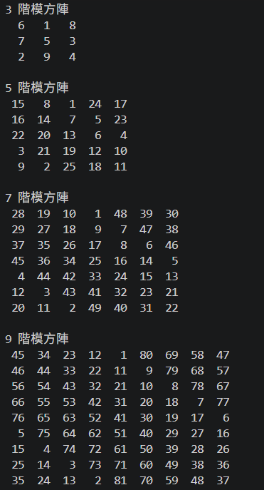

# DataStructure Learning Project

這是資料結構學習專案，課程教師為國立中山大學楊昌彪教授。

本專案用來整理上課實作、作業與自我練習，目標是把每個主題都用可執行程式與簡短筆記留下來，方便複習與累積。

## 已完成內容

1. Homework 1: 奇數階魔方陣（Siamese method）
2. 輸出 1, 3, 5, 7, 9 階魔方陣

## 作業題目資料夾

作業題目檔統一放在 `assignments/problems/`。

目前已整理：

1. `assignments/problems/hw1_problem.doc`

## 作業圖片區

作業執行截圖統一放在 `assets/homework-images/`。

### HW1 輸出截圖

